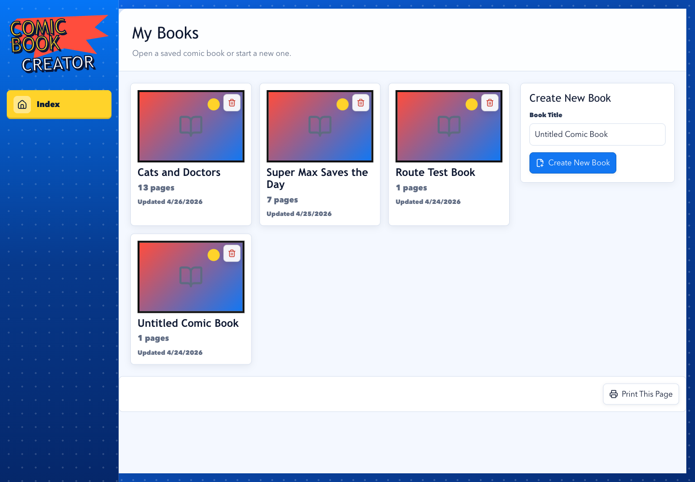
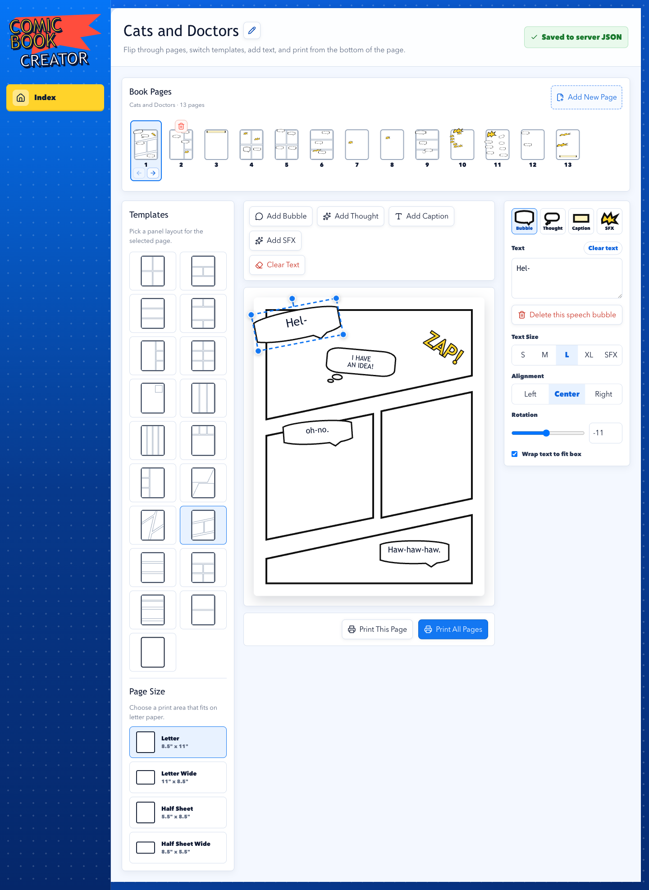
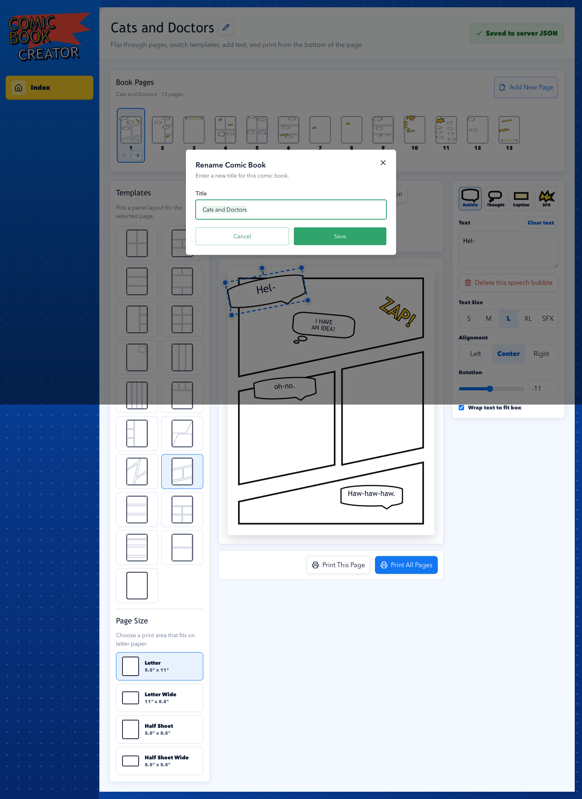

# Comic Book Creator

Comic Book Creator is a SolidStart app for making printable comic books. It gives you a desktop-style editor for saved books, page templates, comic text, paper sizes, autosave, and print-ready page output backed by local JSON persistence.

README last refreshed after commit `b85b6c3` on 2026-04-26. The previous README update was commit `c552739` on 2026-04-25.



## What You Can Do

- Create and open multiple comic books from the library page.
- Add, select, reorder, and delete pages inside a book.
- Choose from rectangular, splash, strip, reveal, letterbox, webtoon-style, and angled action page layouts.
- Switch between letter and half-sheet paper sizes in portrait or landscape.
- Add printable text elements: speech bubbles, thought bubbles, captions, and sound effects.
- Drag, resize, rotate, delete, and retarget selected text directly on the page.
- Change selected text kind, content, font size, alignment, wrapping, and rotation from the side panel.
- Rename books and autosave edits to server JSON.
- Print the current comic page from the app interface.



Dialog flows use the same shared UI system for focused edits and confirmations, including rename, clear text, and delete confirmations.



## Tech Stack

- SolidStart and SolidJS for the app shell and routes.
- Solid Router server functions and API routes for persisted data.
- Panda CSS for generated styling utilities and theme tokens.
- Park UI and Ark UI wrappers for shared UI controls.
- Lucide icons for interface actions.
- AI SDK, OpenAI provider, and Zod for server-side AI workflows elsewhere in the app.
- Vitest, TypeScript, and ESLint for verification.

## Repository Layout

```text
.
├── README.md
├── docs/
│   └── screenshots/
└── app/
    ├── data/
    ├── src/
    │   ├── components/
    │   │   ├── comics/
    │   │   ├── markdown-renderer/
    │   │   └── ui/
    │   ├── lib/
    │   │   ├── comics/
    │   │   ├── projects/
    │   │   └── spatial-map/
    │   └── routes/
    ├── panda.config.ts
    ├── package.json
    └── pnpm-lock.yaml
```

Important app paths:

- `app/src/routes/index.tsx`: book library route.
- `app/src/routes/books/[bookId].tsx`: comic editor route.
- `app/src/components/comics/`: comic editor, templates, paper preview, print actions, and text tools.
- `app/src/lib/comics/`: comic book types, server persistence, and data access.
- `app/data/comic-books/`: local JSON files for saved comic books during development.
- `app/styled-system/`: generated Panda output. Do not edit this directory by hand.

## Getting Started

Run commands from `app/`.

```bash
cd app
pnpm install
pnpm dev
```

The development server runs at:

```text
http://localhost:3000/
```

The project requires Node `>=22` and pnpm.

## Environment

Copy `app/.env.example` if you need AI-backed server workflows:

```bash
cp .env.example .env
```

Relevant variables:

```text
OPENAI_API_KEY=your_openai_api_key_here
OPENAI_MODEL=gpt-5-mini
OPENAI_HEAVY_MODEL=gpt-5.4
APP_DATA_DIR=/app/data
```

For local development, the app falls back to `app/data` when `APP_DATA_DIR` is not set.

## Scripts

Run these from `app/`.

```bash
pnpm prepare      # Generate Panda styled-system output
pnpm dev          # Generate styles and start the dev server
pnpm lint         # Run ESLint
pnpm lint:fix     # Run ESLint with fixes
pnpm type-check   # Run TypeScript without emitting files
pnpm test         # Run Vitest
pnpm build        # Build for production
pnpm start        # Start the built app
```

## Data Model

Comic books are persisted as JSON records with this shape:

```ts
interface ComicBook {
  id: string;
  title: string;
  updatedAt: string;
  pages: ComicPage[];
}

interface ComicPage {
  id: string;
  title: string;
  status: "Blank" | "Draft" | "Ready";
  layout:
    | "four"
    | "bigTop"
    | "threeStack"
    | "wideMiddle"
    | "splashLeft"
    | "six"
    | "splashInset"
    | "threeVertical"
    | "fourStrip"
    | "revealBottom"
    | "heroRight"
    | "diagonalAction"
    | "diagonalGrid"
    | "cinematicSlant"
    | "letterbox"
    | "establishingDialogue"
    | "webtoonStack"
    | "doubleFeature"
    | "blank"
    | "custom";
  paperSize?: "letter-portrait" | "letter-landscape" | "half-portrait" | "half-landscape";
  customGrid?: {
    verticalLines: number[];
    horizontalLines: number[];
  };
  texts: ComicTextElement[];
}

interface ComicTextElement {
  id: string;
  kind: "speech" | "thought" | "caption" | "sfx";
  text: string;
  panelIndex: number;
  positionScope?: "panel" | "page";
  x: number;
  y: number;
  width: number;
  height?: number;
  fontSize: number;
  rotation?: number;
  align: "left" | "center" | "right";
  autoWrap?: boolean;
}
```

During development, saved books live in `app/data/comic-books/*.json`. The server normalizes records on read/write so missing or stale fields remain compatible with the current editor, including older panel-scoped text positions and missing rotation values.

## Docker

A production Docker Compose file lives at `app/docker-compose.yml`.

```bash
cd app
docker compose up --build
```

The container stores persistent app data in the `comic-book-data` named volume and exposes the app on container port `3000`. Set `APP_PORT_EXPOSE` to bind a host port, for example:

```bash
APP_PORT_EXPOSE=3000 docker compose up --build
```

## Development Notes

- Keep reusable UI in `app/src/components/ui/` or feature folders under `app/src/components/`.
- Keep route files thin and move reusable component logic out of `app/src/routes/`.
- Prefer server actions or API routes for writes and `query()` plus router resources for reads.
- Do not edit `app/styled-system/`; run `pnpm prepare` to regenerate Panda output.
- Use `resource.latest` for steady UI during revalidation when adding router resources.
