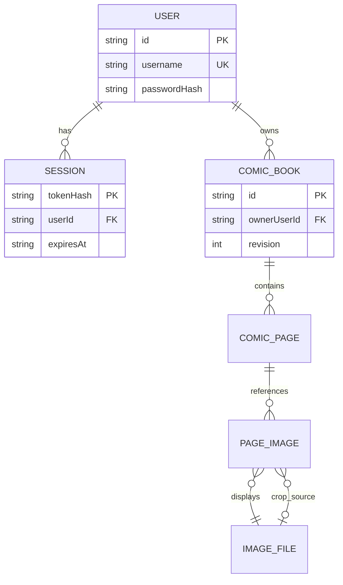
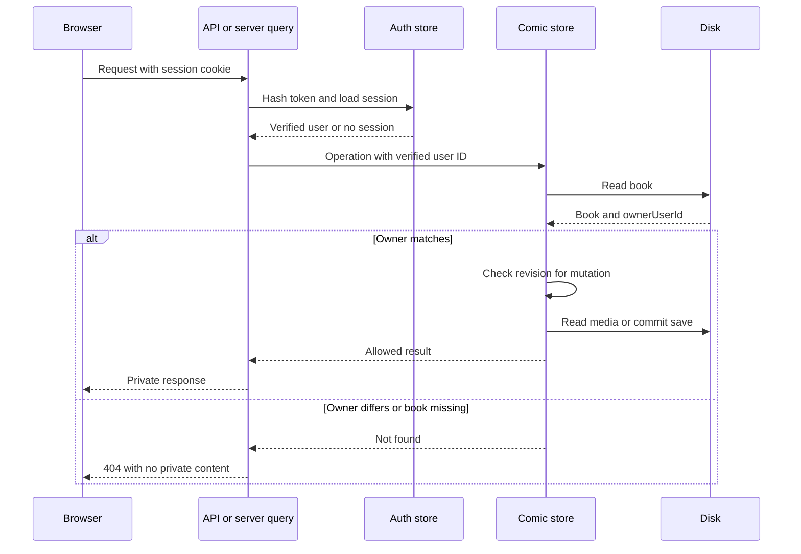
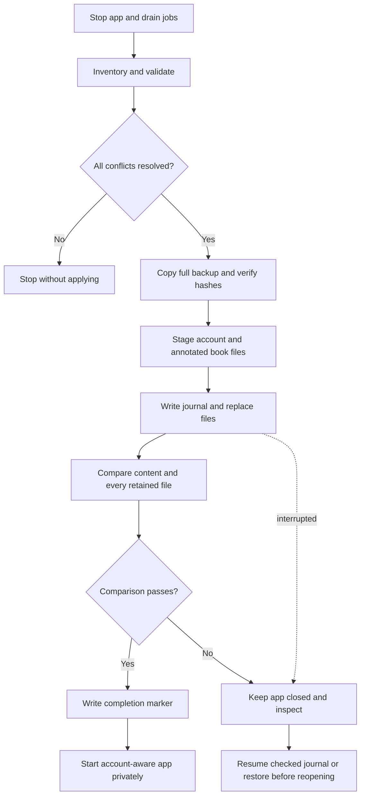
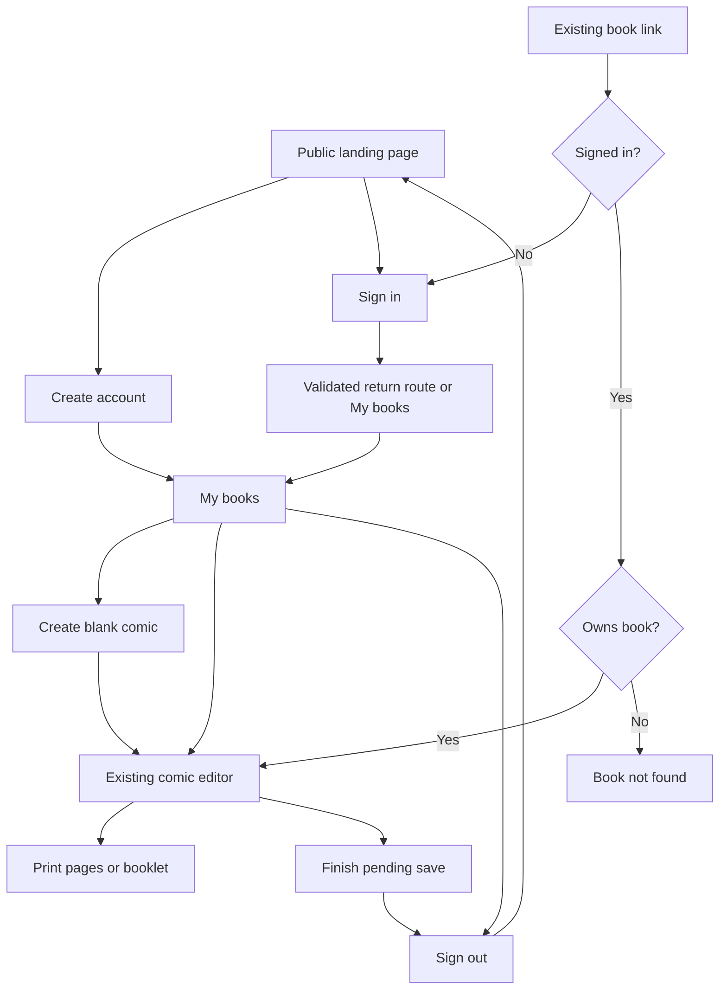

# Comic Book Creator accounts — implementation plan

## User name signup update — 2026-10-03

User names now replace the previous account identifier throughout the app, stored accounts, sessions, forms, and configuration.
LEGACY_USERNAME selects the first signup that claims legacy data. That signup uses its chosen password.
Startup validates pending storage but does not migrate it. A complete verified persistent copy still precedes source changes.
Byron explicitly selected first matching signup ownership, with no additional claim code. Other signup waits until completion.
This update and the current migration guide supersede previous startup-password and offline-only setup instructions below.


## Automatic migration update — 2026-10-03

The current release uses matching signup migration when LEGACY_USERNAME is supplied.
A verified persistent copy precedes all source changes. Matching signup supplies the account password.
Normal requests never migrate data. Completion checks permit later account and book changes.
The [current migration guide](../../../docs/account-migration.md) supersedes offline-only startup and manual cutover instructions below.
Backups and recovery records are permanent. No live operation is authorized by this implementation.

## Plan at a glance

Keep disk storage. Introduce a user registry, password hashes, persistent sessions, and an explicit owner on every book. Preserve the current book IDs and image paths. Move the library from `/` to `/books`, then use `/` to explain the product.

Prove migration before changing the live site. The migration must use raw JSON, preserve existing values, and add only ownership and revision fields. It must not call the existing seed or normalization functions. Set up the legacy account from `LEGACY_USERNAME` and a locally entered password before opening public registration.

Implement in five outcomes:

1. A copied library has a verified owner and unchanged content.
2. The legacy user can sign in, edit, and retrieve private images.
3. A second account can work without seeing or changing legacy data.
4. Visitors understand the site and can create an account.
5. A stopped production volume can migrate and restart with checked recovery options.

The first four outcomes use disposable data. The fifth is a future, separately authorized deployment operation. This document authorizes no execution. All commands below describe proposed commands or future checks.

The main simplification is to add ownership in place. Moving files, adding a database, and changing book URLs would increase migration work without improving this release's outcome. Keep one runtime storage version. Do not introduce a fallback that treats an unauthenticated request as the legacy user.

## Implementation tickets

Local tracker epic: [cb-pix7](../../../.tickets/cb-pix7.md). The original seven child tickets cover the five milestones. A server-contract child separates server proof from browser acceptance. Tickets own current dependencies, status, and evidence.

| Ticket | Outcome | Construction prerequisite |
|---|---|---|
| [cb-xp5r](../../../.tickets/cb-xp5r.md) | Prove legacy ownership migration without content loss | None — first proof |
| [cb-3g5e](../../../.tickets/cb-3g5e.md) | Let the legacy account use a private comic library | [cb-xp5r](../../../.tickets/cb-xp5r.md) |
| [cb-ud97](../../../.tickets/cb-ud97.md) | Accept the private account server contract | [cb-xp5r](../../../.tickets/cb-xp5r.md) |
| [cb-tt7r](../../../.tickets/cb-tt7r.md) | Create separate accounts with isolated comic libraries | [cb-ud97](../../../.tickets/cb-ud97.md) |
| [cb-jqfr](../../../.tickets/cb-jqfr.md) | Protect drafts during expiry and account changes | [cb-ud97](../../../.tickets/cb-ud97.md) |
| [cb-f2t6](../../../.tickets/cb-f2t6.md) | Explain the site and connect account entry flows | [cb-ud97](../../../.tickets/cb-ud97.md) |
| [cb-t8jr](../../../.tickets/cb-t8jr.md) | Package and rehearse the account migration release | [cb-ud97](../../../.tickets/cb-ud97.md) |
| [cb-irrm](../../../.tickets/cb-irrm.md) | Migrate the live library after explicit rollout approval | [cb-f2t6](../../../.tickets/cb-f2t6.md), [cb-t8jr](../../../.tickets/cb-t8jr.md) |

Browser acceptance still covers signup, draft recovery, navigation, and printing together. Construction dependencies do not waive those checks.

Migration precedes private-library access. Signup, draft protection, and release rehearsal follow that boundary. The user has authorized implementation and stacked pull requests. Tickets own current status and proof. Live migration requires separate rollout approval.

## Review of the current site

Review basis: source at `54282e8`, existing repository screenshots, deployment files, and a read-only local data inventory. No browser flow, test suite, migration, or production inspection ran. A process listens on localhost port 3000, but its data target was not verified. Do not use it for migration or destructive checks.

| Current area | Finding | Required change |
|---|---|---|
| `src/routes/index.tsx` | `/` loads the shared library immediately | Public landing page; move library to `/books` |
| `src/routes/books.tsx` | Layout only passes through children | Add account-aware shell; keep server checks on data operations |
| `src/lib/comics/types.ts` | `ComicBook` has no owner or save revision | Add required `ownerUserId` and `revision` |
| `src/lib/comics/data.server.ts` | Reads seed an empty store; writes normalize whole records | Remove implicit seeds; separate migration from normal editor saves |
| Same persistence module | `PUT` can create missing files; writes replace files directly | Update existing owned books only; serialize atomic replacements |
| `src/lib/comics/data.ts` | SSR reads call APIs without the incoming cookie | Direct server queries using the current request |
| Comic API routes | List, read, write, delete, and upload have no authentication | Authenticate and check ownership on every operation |
| Image GET route | Sends `public, max-age=31536000, immutable` | Use a new private image URL namespace and private no-store responses |
| `ComicCreatorApp.tsx` | Debounced full-book saves; generic error; timer cleared on unmount | Handle session expiry, conflicts, pending saves, and account changes |
| Project/spatial APIs and server actions | Inherited global data operations remain callable in source | Require the legacy account before reading, writing, or starting jobs |
| Docker | Node 22, one named data volume; runtime lacks source/scripts | Package a usable migration command and document stopped-volume access |

Paths in this document are relative to `app/`, unless stated otherwise. The current README omits newer image and crop fields. Treat current types and raw files as the migration reference.

Local `app/data` contains six book JSON files, 30 pages, 66 text elements, and nine comic image files. Five page-image entries and one crop-source reference resolve. Other data includes `projects/`, `images/`, and `spatial-map.json`. Preserve the entire tree, including files that no current book references. Repeat the inventory against the actual deployment volume before migration.

## Implementation strategy

### Ownership and storage contract

Use one account for one person's library. User IDs are immutable UUIDs. User name is a unique login identifier, not a directory name or foreign key. Trim and lowercase username consistently at signup, login, and migration. Do not strip dots or plus suffixes. This is an explicit application policy, not a claim that all mail systems compare addresses the same way.

Keep these minimal records:

```ts
interface User {
  id: string;
  username: string;
  passwordHash: string;
  createdAt: string;
}

interface UserStore {
  schemaVersion: 1;
  users: User[];
}

interface Session {
  tokenHash: string;
  userId: string;
  createdAt: string;
  expiresAt: string;
}

interface DataState {
  schemaVersion: 2;
  legacyUserId: string | null;
  migrationId: string;
  completedAt: string;
}

interface ComicBook {
  id: string;
  ownerUserId: string;
  revision: number;
  title: string;
  updatedAt: string;
  pages: ComicPage[];
}
```

`passwordHash` includes its algorithm, work parameters, salt, and derived key. Do not add plaintext passwords or speculative verification/reset fields. Return only `{ id, username }` from current-user queries. `ComicPage` and nested image/text types retain their present content fields.



Pages and image entries remain embedded in book JSON. The diagram shows relationships, not new tables. An original crop file need not appear as a displayed image. Never delete it because it lacks a displayed-image entry.

```text
APP_DATA_DIR/
  data-state.json                    # Version and completed legacy assignment
  auth/
    users.json                       # Small unique-username account registry
    sessions/<sha256-token>.json      # Server sessions; raw token never stored
  comic-books/<existing-id>.json      # Same files, plus ownerUserId and revision
  comic-book-images/<book-id>/*       # Unmoved, unchanged image bytes
  projects/                          # Retained; legacy account access only
  images/                            # Retained auxiliary data
  spatial-map.json                    # Retained; legacy account access only
  migrations/<migration-id>/          # Journal and comparison report
```

Place the full backup outside this tree. This avoids copying a backup into itself and keeps recovery files out of normal scans. Keep it on storage that survives a failed deployment. Restrict account, session, journal, and backup access to the service operator.

New book IDs use random UUID-based IDs. Old IDs remain valid. Titles can repeat across accounts. The server chooses new IDs and owners; neither comes from a submitted create request. Save requests cannot transfer ownership. Images gain no separate owner field: access requires the containing book's owner.

### Runtime boundaries

Add `requireUser(request)` and `requireLegacyUser(request)` in `lib/auth/`. Server functions can obtain the current request through `getRequestEvent()`. Pass the verified user ID explicitly into storage functions. Never keep a current user in module-global state. Solid provides request-scoped access through [getRequestEvent](https://docs.solidjs.com/reference/server-utilities/get-request-event).

Use direct functions such as `listBooks(userId)`, `getBook(userId, bookId)`, and `saveBook(userId, bookId, expectedRevision, input)`. Keep raw migration helpers separate from request-facing functions. Require the owner check inside the storage operation as well as authentication at the transport boundary.



Return `401` for missing sessions on JSON/API calls. Redirect protected page requests to sign-in with a validated local return path. Use `404` for another user's book or image. Use `409` for an account-context mismatch or stale save revision. Use `403` for an invalid write origin. Use `503` for incomplete migration. Do not turn broken storage into an empty library.

Validate book IDs and filenames as complete path segments. Reject invalid input instead of silently converting it with `slugify`. Reuse the existing filename basename check. Check ownership before reading image bytes or deleting directories.

### Passwords and sessions

Use asynchronous Node `scrypt`, a random salt of at least 16 bytes, and constant-time key comparison. Start with `N=131072`, `r=8`, `p=1`, a 64-byte key, and `maxmem=256 MiB`. Node's default memory limit needs an override for this cost. Confirm memory and latency in the actual Node 22 container. See [Node crypto](https://nodejs.org/docs/latest-v22.x/api/crypto.html#cryptoscryptpassword-salt-keylen-options-callback) and [OWASP password storage](https://cheatsheetseries.owasp.org/cheatsheets/Password_Storage_Cheat_Sheet.html).

Proposed password policy: 15–128 characters, spaces allowed, no composition rules, no trimming or silent truncation. Bound request size before hashing. Add small, expiring in-process limits for failed login/signup attempts and concurrent hash work. Keep this local; do not add Redis or a lockout-management product. Use the same login failure message for missing accounts and wrong passwords.

Issue a fresh 32-byte random token after successful authentication. Store its SHA-256 digest and session record on disk. Hash incoming cookie values for lookup. Do not store the raw token in URLs, logs, localStorage, or the account registry. Use a 30-day absolute expiry as the initial product default. Missing, corrupt, expired, or revoked sessions cannot authorize a request.

Set the cookie with `HttpOnly`, `SameSite=Lax`, a path covering the configured app base, and `Secure` in production HTTPS. Omit `Domain`. Delete it with the same name/path attributes at logout. Server-side session records allow immediate revocation. These choices follow the relevant [OWASP session guidance](https://cheatsheetseries.owasp.org/cheatsheets/Session_Management_Cheat_Sheet.html).

Use Vinxi's cookie helpers. Do not implement a second signed-cookie session system or add a session-signing secret for an opaque random token. SolidStart supports server-side cookie handling; the disk session lookup is application-owned. See [SolidStart sessions](https://docs.solidjs.com/solid-start/v1/advanced/session).

All browser mutations, including signup, login, logout, forms, uploads, and deletes, must pass an exact Origin check. Compare against configured `APP_ORIGIN`; reject missing or different origins. SameSite is an additional control. Do not trust arbitrary proxy headers to decide the allowed origin. Validate post-login return paths against the local `/books` route family and configured base path.

### Disk writes and saves

Add a small helper that writes a unique temporary file in the destination directory, flushes it, then renames it. Flush the directory where supported by the target filesystem. Failed writes must leave the previous complete JSON readable. Ignore temporary files when scanning records.

Serialize account-registry mutations around read, duplicate-username check, and replacement. This prevents two concurrent signups from losing a user or creating duplicate normalized usernames. Serialize each book's ownership check, revision check, and mutation. One process is a hard deployment assumption; an in-process queue does not protect multiple servers.

Initialize migrated books at `revision: 1`. Require the expected revision for saves and deletes. Increment it only after a successful save. A stale tab receives `409`, retains its draft, and offers reload or draft download. Do not auto-merge or retry over newer data. This small conflict check protects existing full-book autosave without introducing collaborative editing.

### Local proof and dependency ladder

| Dependency | First proof | Later proof |
|---|---|---|
| Disk and legacy data | Real filesystem in a disposable directory; synthetic edge cases | Stopped, copied deployment volume; then authorized volume cutover |
| Password hashing | Absent from dry-run inventory; real Node crypto during account preparation | Actual runtime image memory/latency check |
| Solid cookies, SSR, actions | Absent from migration proof | Isolated local HTTP flow; later HTTPS cookie/proxy smoke |
| User name, identity provider, database | Absent | None in this release |

Use controlled files and interrupted writes for failure checks. A mock disk cannot prove file replacement or recovery. No cloud emulator or external credentials are needed. Keep only focused preservation, isolation, session, and save-conflict checks. The repository requires explicit authorization before running tests or browser automation; this plan does not run them.

## Milestone 1: A copied library gains an owner without content loss

### Changes

Add a TypeScript migration command under `scripts/` and small shared account, password, and disk helpers. Add `tsx` through pnpm if required to run the command on the pinned runtime. Do not create a general migration framework.

The proposed interface is:

```sh
pnpm accounts:migrate --data-dir /absolute/disposable-data --dry-run
pnpm accounts:migrate --data-dir /absolute/disposable-data --apply
pnpm accounts:verify --data-dir /absolute/disposable-data
```

Read `LEGACY_USERNAME` from the command environment. Require it when legacy data exists. Supply the initial password through a hidden terminal prompt with confirmation during apply. Never use a default password or an argument visible in shell history. Do not let public signup create or claim this account.

The command must require an explicit absolute data path. It must print the resolved target and proposed username before applying. Do not use `resolveAppDataDir()` fallback to select a migration target. The operator must stop the app and drain jobs first; a migration lock prevents two migrators, not an older app from writing.

### Migration procedure

1. Inventory all files, sizes, and SHA-256 hashes without calling app read functions.
2. Parse book JSON strictly. Check IDs, filenames, pages, displayed images, and crop-source files.
3. Report malformed records, duplicate IDs, invalid paths, missing images, and unexpected ownership. Abort apply on unresolved conflicts.
4. Preserve unreferenced images and unknown files. Report them; do not treat them as cleanup candidates.
5. Create a full, read-only backup outside the data root. Verify its complete manifest against the stopped source.
6. Allocate one legacy user ID. Prepare its account record and password hash once.
7. Stage book copies with only `ownerUserId` and `revision` added. Retain every existing JSON value and unknown field.
8. Write a journal with migration ID, source/target hashes, account ID, target username, and backup location.
9. Replace staged files atomically. Preserve the journal through any interruption.
10. Compare results, verify image bytes and references, then write `data-state.json` last.



Normal runtime must reject missing/incomplete schema state. A second apply after completion is a no-op when the assignment matches. A different `LEGACY_USERNAME` is a conflict, not a transfer request. Normal startup does not re-read that variable to change ownership.

For interruption recovery, each file must match its recorded source hash or target hash. Reuse the journal's user ID. Resume only those checked replacements. Stop on any third value. If no commit began, discard only the command's own staged files and retry. Preserve the backup and journal until the rollout is accepted.

A genuinely empty install uses an explicit initialization path that creates an empty registry and `legacyUserId: null`. A nonempty legacy tree must not be mistaken for a fresh install. Never initialize or seed data during a web request.

### Verification

On disposable fixtures, compare parsed books after removing only the two new fields. Require exact nested value equality, including `updatedAt`, trailing spaces, page IDs/order, crop corners, and unknown fields. Require byte-identical images and unchanged auxiliary files. Run twice. Interrupt after one committed book and resume. Exercise malformed JSON, missing source images, wrong username, and an unexpected file change.

Rehearse on a copy of local data only after stopping its writer or obtaining a consistent snapshot. Do not claim the current read-only inventory is a consistent backup.

### Desired end state

- The copied legacy library belongs to one prepared account.
- The report accounts for every source file and every allowed change.
- Production stays on its existing code and untouched data.

## Milestone 2: The legacy account can sign in and use a private library

### Changes

Implement login/logout forms, session resolution, and the protected `/books` library first. Keep public signup unavailable in this intermediate build. Serve the new build only against the completed disposable store.

In `lib/comics/data.server.ts`, require the verified user for list, read, create, save, delete, image path resolution, and upload. Filter summaries by owner. Preserve trusted ownership/revision fields through normal reads and saves. Remove implicit sample seeding. A missing book update returns `404`; only create makes a new file.

Split disk access from the large normalization/layout module while touching it. Do not redesign normalization. Migration remains separate. Record owners must never come from spreading submitted JSON over trusted metadata.

Replace comic query self-fetching with `query(async (...) => { "use server"; ... })`, then read through resources. Use `resource.latest` where steady content is wanted. Avoid serializing private data into unauthenticated HTML. Keep account identifiers in query arguments for cache separation, but verify them against the session. Router cache keys include arguments, and browser history can reuse entries. See [Solid Router query](https://docs.solidjs.com/solid-router/reference/data-apis/query).

The old singleton `/api/comic-book` route and `getComicBook` query have no current UI caller in the inspected source. Remove their obsolete read/write entry points after confirming callers again. Do not leave them as an unguarded alternate path.

### Close all exposed paths

| Surface | Required behavior |
|---|---|
| Book list and single-book query | Resolve current user; return only owned books |
| Create, autosave, delete | Authenticate; check Origin; check owner and revision as applicable |
| Image upload | Authenticate before reading body; check owner before writing bytes |
| Image GET and crop source | Authenticate and check containing book owner |
| Protected SSR route | Redirect unauthenticated user without exposing book metadata |
| `/api/projects` and every nested route | Require legacy account before store, job, export, or stream access |
| `lib/projects/data.ts` server actions | Apply the same legacy guard inside every callable action |
| Spatial-map API/query | Require legacy account |
| Project job snapshots and SSE | Guard initial request, verify project/run relation, and close on session expiry/revocation |
| `src/ws/jobs.ts` | Confirm whether registered; remove unused registration or require legacy session if exposed |

Keep inherited files and capabilities available to the legacy user. New comic accounts receive no access to them. Do not extend project ownership in this release. Guards must run before any read helper that may normalize or persist data. Convert retained project/spatial SSR queries to guarded direct server reads too; otherwise their self-fetch calls lose the incoming session.

Use a new private media path, such as `/api/private/comic-books/:bookId/images/:filename`, with `Cache-Control: private, no-store`. Derive this URL for rendering; keep disk paths and migration payload values unchanged. Update upload responses and image normalization together. Retire the old route or make it enforce the same guard without returning public cache headers.

The new URL avoids reusing previously public cached URLs. Existing external caches or downloaded copies cannot be recalled by this change. Inspect and purge a configured CDN cache during rollout, if one exists. Do not assume one exists from repository evidence.

### Verification

Using isolated data, sign in as the legacy user, open an existing book, view both processed and crop-source images, save, and restart. Check unauthenticated direct requests to each surface. Confirm no sample books return after deleting all fixture books. Verify malformed account storage reports an error without replacement or reinitialization.

### Desired end state

- The legacy user can use the copied comic library through an authenticated request.
- All known alternate access paths require the appropriate account.
- The build is runnable with registration closed; rollback discards only disposable rehearsal data.

## Milestone 3: A second account cannot read or overwrite another library

### Changes

Add registration as a named server action accepting `FormData`. Use a real POST form and `normalizeActionUrl(...)`. Persist the user before issuing a session. If session creation fails, keep the account and invite sign-in; never delete it as compensation. Serialize the unique-username check and registry write.

Start each new account with zero books. The create-book action creates a blank owned book using the existing editor defaults. Reuse form submission state, clear handled results, and keep passwords out of returned errors and logs. Do not build a reset link, verification screen, or mail queue.

Use a full document navigation after successful signup, login, and logout to clear in-memory account data. Recheck session on restored pages and tab focus. On account change, hide the old library/editor before loading the new account's data. Clear relevant router cache entries. Do not rely on cache keys alone to authorize access.

Add a captured account ID to editor mutations as a context check. The server compares it with the session; it never accepts it as authority. This prevents an old tab from creating books or uploading files under an account selected in another tab.

Extract a small autosave controller from `ComicCreatorApp.tsx`. Permit one save in flight per editor. Keep the newest pending snapshot, and track the last confirmed server revision separately from local edits. Apply acknowledgments without replacing newer text. On `401`, `409`, or account mismatch, pause saves and keep the draft. A same-account sign-in may resume only after verifying the current revision.

Before intentional logout or navigation, finish the pending save or offer an explicit cancel/discard choice. If saving cannot finish, allow download of a recovery JSON draft. Do not force navigation on expiry. Warn on closing a dirty editor. Browser termination can still lose unsaved memory; this release does not promise offline editing or crash recovery.

### Verification

Use account A, account B, and no session. Check list, read, PUT, DELETE, upload, image, original crop image, and removed singleton endpoints. Submit A's book ID and owner ID from B; neither may reveal or change A's files. Inspect serialized HTML and image headers as well as JSON.

Race two registrations for differently cased versions of one username. Exactly one account must exist. Race two saves at the same revision. Exactly one commits. An interrupted replacement must leave complete old or new JSON. Check session expiry, logout revocation, and restart persistence.

In two tabs, sign out of A and into B. A's old tab must not save, upload, delete, or create as B. Retain A's unsaved draft until an explicit discard or recovery action. Check Back navigation for stale account content.

### Desired end state

- New accounts have independent empty libraries and persistent sessions.
- Cross-account and stale-tab operations cannot change another account's records.
- Save conflicts and expired sessions remain visible without silent draft replacement.

## Milestone 4: Visitors understand the site and can start a comic

### Route and interaction design



| Route | Purpose |
|---|---|
| `/` | Explain the site; show create-account/sign-in, or My books when signed in |
| `/sign-up` | User name, password, password confirmation, and inline validation |
| `/sign-in` | User name/password with validated return destination |
| `/books` | Private library, empty state, create-book form |
| `/books/:bookId` | Existing editor; account and save-state controls |
| Logout POST action | Revoke current session and return to landing page |

Honor `BASE_PATH` in routes, API URLs, forms, redirects, and cookies. The current code contains root-relative URLs. Add one small path helper where needed; do not invent client/server URL fallbacks.

### Landing page content

Keep the existing playful comic identity. Use a simpler public layout without the editor's side rail or print footer.

```text
Logo                                     Sign in   Create account

Make a comic book you can print.
Choose page layouts, add words and pictures,
then print your story.
[Create account]  [Sign in]               Static example comic

Choose a layout      Add text and photos      Print your book

Example page + short explanation of layouts, speech bubbles,
photo pages, and print options.

Your account keeps your saved books together.
[Create account]
```

Use a repository-owned demo illustration or synthetic comic. Do not load a real user's book or private image for the landing page. Do not claim identity verification, sharing, collaboration, or recovery. The draft text above defines content needs; final visual polish stays modest.

Add focused components under `components/landing/` and `components/auth/`. Keep route files thin. Reuse shared input/button wrappers, Panda tokens, visible labels, keyboard focus, and error text linked to fields. Use appropriate username/password autocomplete values. Make the hero, form, and library empty state usable on narrow screens.

Update `ComicAppNav` so Books points to `/books`. Show the signed-in username and a POST sign-out control. Keep account details out of printed pages. Add public page metadata and avoid indexing private book routes.

### Verification

When browser checks are authorized, use an isolated server and disposable accounts. Confirm a visitor can explain the product, register, create a book, save, sign out, and return. Check narrow layout, keyboard form use, inline errors, and print output. Verify the landing page issues no private book query and remains safe to render without a session.

### Desired end state

- `/` explains the product with a clear route to signup or sign-in.
- Each account can complete the core comic workflow.
- Existing editor and print behavior remain available behind the account boundary.

## Milestone 5: The deployment volume migrates with a checked recovery path

### Configuration and packaging

| Setting | Use |
|---|---|
| `APP_DATA_DIR` | Existing persistent runtime root; migration still requires an explicit target argument |
| `LEGACY_USERNAME` | Required migration input for existing data; never a runtime ownership fallback |
| `APP_ORIGIN` | Canonical browser origin for mutation checks; required for production |
| `BASE_PATH` | Existing deployment prefix, applied consistently to auth and app paths |
| Initial password | Hidden operator input; no committed value, default, or public claim flow |

Update `.env.example`, Compose, and setup documentation. Keep server-only configuration out of Vite public variables. The opaque-token design needs no `SESSION_SECRET`.

Package the TypeScript migration command and its shared helpers with its runner in the Docker image, or provide a dedicated migration image from the same build. Choose the single-image option first. Add a documented one-off invocation against the same named volume while the app service is stopped. Verify that the built image contains every required file; the current runtime copies only `.output`, `node_modules`, and `package.json`.

Document local installation, fresh-store initialization, legacy migration, backups, and the lack of website recovery flows in both READMEs. Do not add a credential-reset tool in this scope. Lost credentials require a separate operator intervention.

### Cutover and rollback

Build and verify the release before the maintenance window. Confirm the real mounted volume, available space, service UID permissions, HTTPS origin, base path, and proxy cache behavior. Rehearse with a stopped-volume copy first.

Stop the old service and drain background jobs. Capture and verify the full backup. Run dry-run, apply, and verify using the release's command. Start the new app with public traffic blocked. Check legacy sign-in, counts, image retrieval, one controlled save, and session persistence. Reopen traffic only after checks pass.

Before new writes, recovery can restore the complete backup and old release. Retain any controlled smoke edits separately or discard only known disposable checks. Never run old code against migrated data: its normalizer drops the new fields.

After new registrations or edits, restoring the old snapshot would lose data and expose a shared library. Keep traffic closed, preserve the current volume, and repair forward or use an account-aware prior build. Any restore must first reconcile later changes with their owners. Do not advertise an automatic, lossless downgrade after reopening.

### Verification

Use the same file/content comparison as the rehearsal. Confirm that a second migration cannot duplicate or reassign the legacy account. Restart the actual runtime image and verify sessions and books persist. Check Secure cookies and Origin handling through the deployed HTTPS path. These operational checks are future work; no production checks ran during planning.

### Desired end state

- Every pre-migration file has a documented preservation result and a verified backup.
- The legacy account owns its existing library; new accounts own only their new work.
- One account-aware release uses the persistent volume, with a documented recovery boundary.

## Cross-cutting verification

Run `pnpm type-check`, `pnpm lint`, and `pnpm build` during implementation. If tests are authorized, keep a small focused suite for migration preservation, auth/session lifecycle, isolation, and stale-save rejection. Avoid UI snapshot coverage and tests that merely repeat object shapes. Existing tests that read the real `data/spatial-map.json` need an isolated fixture before inclusion.

Browser verification requires explicit authorization under `AGENTS.md`. First inspect any running server and its data target. Use it only if it points to disposable data. Otherwise arrange a separate isolated instance. Never turn the discovered localhost server into a test target by assumption.

## Open decisions and spikes

1. **Deployment facts.** Identify the actual volume, proxy, base path, and HTTPS origin before cutover. If unknown, stop at local proof.
2. **Crypto budget.** Measure the proposed scrypt settings in the runtime image. If memory is too tight, use a documented lower-memory scrypt work combination and remeasure. Do not silently weaken to a fast hash.
3. **Inherited tools.** This plan keeps project/spatial tools legacy-only. If they must serve all accounts now, expand their ownership design before exposing them. The default remains a legacy guard.

No account username, credential, or production target is needed to review this plan.

## Below the cut line

- Resend, verification messages, password reset, social login, and magic links.
- Profile editing, username changes, account deletion, admin screens, roles, teams, and sharing.
- A database migration, object storage, multiple processes, or distributed locks.
- Multi-user project/spatial/AI workflows beyond legacy-only access.
- Offline editing, automatic draft merge, revision history, and device synchronization.
- A broad redesign of the editor, image pipeline, or print tools.
- Automatic deletion of old backups, unknown files, or unused image sources.
