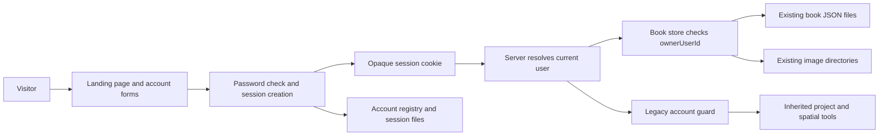

# Comic Book Creator accounts — shape brief

## Recommendation

Add accounts and server-side sessions to the existing disk store. Add `ownerUserId` and a save `revision` to each book. Keep book filenames, book IDs, image directories, and editor URLs. Images inherit ownership from their containing book.

Use `LEGACY_USER_EMAIL` during an explicit offline migration. Create a stable user ID and set the account password through a hidden local prompt. Back up the whole data directory before adding ownership fields. Record the completed assignment so a later environment change cannot transfer the books.

Make `/` the public landing page, `/books` the private library, and `/books/:bookId` the existing editor. Provide registration, sign-in, and sign-out. Keep verification, password reset, and email services outside this release.

The main pushback is against moving every book into a new folder tree. Ownership fields provide the required boundary with fewer file changes. This makes preservation easier to inspect and avoids rewriting image references.

## Problem and appetite

The shared library has no way to identify a user or restrict access. A login screen alone would not fix this. Every saved-book and media request needs a server ownership check.

The intended scale is one personal-project server with a persistent disk volume. Use small functions, direct data access, existing framework forms, and built-in password hashing. No database service, general permission system, or auth provider is needed.

## Core shape

The account registry is the authority for unique email addresses. Book records are the authority for comic ownership. A session file connects a random token hash to a user ID. The browser receives only the opaque token and a safe account summary.

Normal requests never use `LEGACY_USER_EMAIL` to choose an owner. They use a verified session. An offline migration record identifies the legacy owner of inherited non-comic data.

## Current fit

Reuse `lib/server/data-dir.ts`, the Docker volume, comic types, image paths, the editor, print tools, shared form controls, and action URL normalization.

Add a small `lib/auth/` module, atomic disk writes, an offline migration command, and landing/account components. Split the growing comic persistence and autosave code at the affected boundaries.

Replace three unsafe assumptions. An empty directory must stop creating sample books. A `PUT` must stop creating a missing book. A private image must stop returning a public, year-long cache policy.

Replace SSR self-fetching in comic queries with server functions that use the request's account. The existing helper makes a new HTTP request without forwarding the incoming cookie. Retain the current API path for autosave, uploads, and confirmed deletes.

## How to make this go better

- **Prove preservation first.** Rehearse migration on a separate copy and compare all files before building account screens.
- **Keep storage paths stable.** Add ownership metadata while retaining IDs, nested content, and image bytes.
- **Make one owner check unavoidable.** Require a server-resolved user in all comic store operations, including image access.
- **Close inherited entry points.** Restrict old project APIs and server actions to the legacy account without rebuilding that product.
- **Handle interrupted editing.** Stop failed autosaves, retain drafts, and prevent an old tab from saving under a different account.

## First proof

The first question is whether ownership can be added without changing existing creative content or losing image sources.

The proof is a migration rehearsal against a disposable data directory. It creates one account, annotates copied book records, and produces a file-level comparison. A second run must make no changes. An interrupted run must resume only when each file matches a recorded source or target hash.

Pass when every input file remains accounted for, nested book values match, image hashes match, and the account assignment is stable. Fail on malformed JSON, conflicting ownership, missing referenced files, or unexplained file differences. Do not make an incomplete copy appear successful by skipping bad files.

This proof excludes a browser, live credentials, production writes, email delivery, and a database. It can change the migration design before app behavior depends on it.

## Rabbit holes and no-gos

Do not add organizations, membership tables, admin screens, password recovery, account deletion, email changes, or public book sharing. Do not refactor inherited project storage into a second multi-user product.

Avoid framework-wide persistence abstractions and compatibility modes. The required disk controls are concrete: complete-file replacement, a small mutation queue, revision checks, and a verified migration backup.

Do not expose two storage versions at once. Old code can remove ownership fields when saving. It must never run against the migrated volume.

## Serious alternative

SQLite would provide transactions and unique email constraints. It remains a reasonable later move if concurrent processes or larger data volumes become real requirements. For this release, it adds another storage transition while images still need a disk backup. A single JSON account registry and existing book files are sufficient for one process.

## Plan handoff

Build the migration proof first. Then prove that the legacy user can sign in and that a second account cannot access their data. Add the public landing page after account boundaries work.

Use one brief maintenance window for the final migration. Restore the checked backup only before new writes resume. After new accounts or edits exist, preserve the current volume and repair forward. The detailed sequence, failure cases, diagrams, and acceptance checks are in the [implementation plan](implementation-plan.md).
